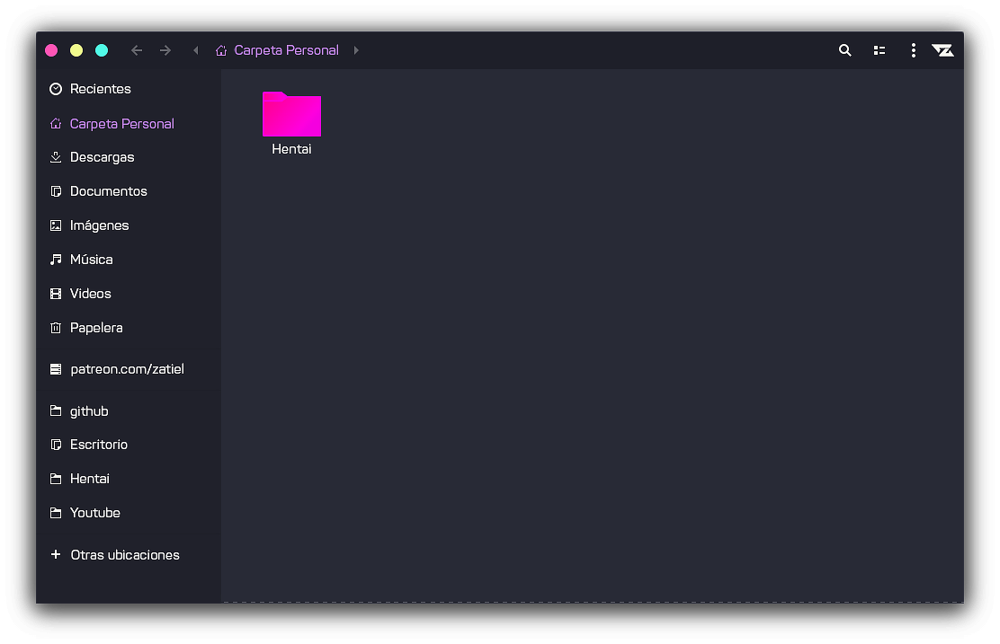

#### Installation

Extract the zip file to the themes directory i.e. `/usr/share/themes/` or `~/.themes/` (create it  if necessary).

To set the theme in Gnome, run the following commands in Terminal,

```
gsettings set org.gnome.desktop.interface gtk-theme "Ant-Dracula"
gsettings set org.gnome.desktop.wm.preferences theme "Ant-Dracula"
```
or Change via distribution specific tool.

### Note:
* This theme is based on the [Ant-Nebula](https://github.com/EliverLara/Ant-Nebula).

# Issues will be fixed asap. Pull Request Welcomed
https://github.com/callmezatiel/zarch/issues

## Buy me a coffee
<a href="https://www.paypal.me/zatiel"></a> <a href="https://www.patreon.com/zatiel"> 
